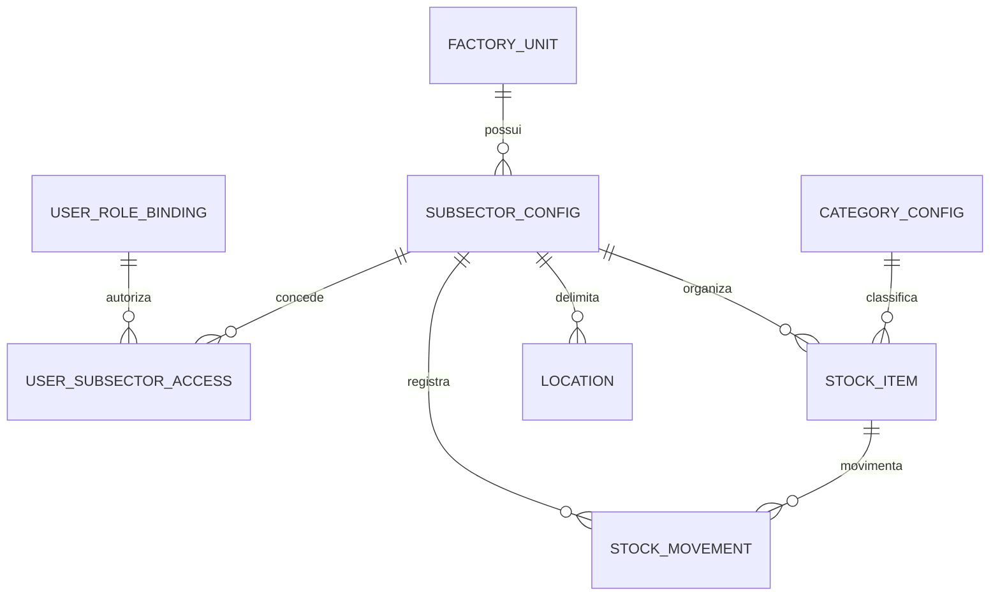

# Análise: subsetores, materiais e permissões

## Status e escopo

Este documento consolida a análise do cadastro de categorias/materiais, subtipos, localizações e da proposta de subsetores operacionais. É uma proposta para revisão; **nenhuma alteração de código, estrutura do banco ou dados foi aplicada**.

A análise inicial foi feita por leitura do código e das migrações. Na Etapa 1, também foi feita uma consulta agregada em transação PostgreSQL somente leitura, sem extrair nomes de usuários nem efetuar gravações. Os resultados abaixo correspondem à base de referência acessível nesta sessão; devem ser confirmados pelo responsável do ambiente antes de qualquer migração.

## Resumo da proposta

Um subsetor deve representar uma área operacional dentro de um setor já existente. Exemplo: `APOIO → SERIGRAFIA`. Materiais, itens de estoque, localizações e movimentações podem ser associados ao subsetor. O subsetor também delimita o acesso dos usuários.

Subsetor não é categoria de material. `SERIGRAFIA` é a área; uma peça serigrafada, tela ou tinta é um material/item dentro dela. Categorias continuam sendo classificações de material. Essa separação evita que “categoria”, “subtipo” e “área de trabalho” disputem o mesmo campo.

O setor continua sendo o enum existente (`APOIO`, `PRE_FABRICADO`, `DISTRIBUICAO` etc.). Os nomes dos subsetores ficam em registros configuráveis, permitindo criar um novo subsetor sem adicionar um valor ao enum. Isso não cria, por si só, um novo formulário ou comportamento de estoque: um fluxo operacional estruturalmente novo ainda pode exigir desenvolvimento.

## Diagnóstico da estrutura atual

### Dados e conceitos

- `CategoryConfig` representa a classificação configurável de material, com nome, setores de uso, perfil interno, unidade e vínculos com estoque/localizações. Não há uma tabela separada de “Material” em Configurações.
- `StockItem` representa o item cadastrado no estoque. Mantém um `categoryId` opcional, um `componentType` e o texto legado `type`.
- `ComponentSubtypeConfig` é apresentado como subtipo, mas também guarda a classificação estrutural interna (`componentType`) que direciona fluxos especializados.
- `Location` representa uma prateleira/local. Há o campo legado singular `categoryId` e a relação muitos-para-muitos `LocationCategory`.
- `StockMovement` guarda o setor, o item e snapshots históricos, mas não tem uma dimensão de subsetor.
- `UserRoleBinding` guarda papel e `assignedSector`; não possui subsetor atribuído.

Referências: [`CategoryConfig`, `ComponentSubtypeConfig` e `Location`](backend/prisma/schema.prisma#L83), [`StockItem` e `StockMovement`](backend/prisma/schema.prisma#L284), [`UserRoleBinding`](backend/prisma/schema.prisma#L170).

### Por que o cadastro atual é confuso

Na tela atual, a pessoa informa nome, setor(es), subtipo, unidade e bloqueio de unidade; depois pode precisar ir à aba de localizações para vincular a categoria a uma prateleira. Há também um gerenciamento separado de subtipos. Isso faz o usuário decidir vários conceitos técnicos antes de conseguir usar o material. A tela explicita um fluxo em duas etapas e oferece opções distintas para salvar a categoria ou seguir para o vínculo com localização.

Referências: [início e formulário de categorias](frontend/src/pages/Settings.vue#L29), [subtipo e unidade](frontend/src/pages/Settings.vue#L121), [gerenciamento de subtipos](frontend/src/pages/Settings.vue#L172), [formulário de localização](frontend/src/pages/Settings.vue#L350).

Além disso, permitir cadastrar um nome novo não garante suporte em todas as operações. Setores e `ComponentType` são enums fixos e partes de estoque, requisições e importações ainda possuem opções ou inferências fixas por nome. Os subtipos criados pelo formulário recebem nome e setores, mas não um novo comportamento operacional.

Referências: [enum de setor e componente](backend/prisma/schema.prisma#L12), [criação de subtipo](backend/src/controllers/SettingsController.ts#L155), [opções fixas do estoque](frontend/src/pages/InventoryHub.vue#L80), [opções fixas em requisições](frontend/src/pages/Requisitions.vue#L1420).

### Classificações fixas a preservar

| Setor | Classificação existente | Perfil esperado |
|---|---|---|
| Pré-fabricado | EVA — sola não processada | Solado |
| Pré-fabricado | Borracha | Solado |
| Distribuição | Cabedal | Cabedal |
| Distribuição | Sola Processada | Solado |
| Peças Cortadas (`APOIO`) | Molde / Peça, conforme catálogo padrão | Peça cortada |
| Montagem | Pé Pronto, conforme catálogo padrão | Pé pronto |

EVA e Sola Processada representam etapas diferentes e não devem ser mescladas. Cabedal pode ser compartilhado entre Apoio e Distribuição se mantiver o mesmo significado e perfil operacional. O catálogo de novas fábricas já contém as classificações fixas e as unidades padrão; as migrações também backfillaram vínculos de categorias e itens em versões anteriores.

Referências: [catálogo padrão](backend/src/provisioning/factoryCatalog.ts#L28), [provisionamento e perfis](backend/src/provisioning/factoryProvisioning.ts#L12), [migração de categorias e estoque](backend/prisma/migrations/20261001120000_category_sector_scope_and_stock_category/migration.sql#L1), [migração de subtipos](backend/prisma/migrations/20261002130000_editable_component_subtypes/migration.sql#L1).

### Duplicatas e manutenção

A categoria é única por unidade fabril e nome literal. A API coloca o nome em caixa alta e remove espaços das extremidades, mas diferenças como espaço interno repetido, acentuação ou separadores podem deixar passar nomes equivalentes, por exemplo `SOLA PROCESSADA` e `SOLA_PROCESSADA`. Uma comparação textual ou aproximada não deve fundir automaticamente itens de etapas distintas.

A edição de nome de categoria pode atualizar o campo legado `StockItem.type`; a exclusão pode retirar referências à configuração usada. Recomenda-se arquivar categorias em uso e separar a mudança de rótulo da identidade histórica do item.

Referências: [unicidade atual](backend/prisma/schema.prisma#L228), [criação da categoria](backend/src/controllers/SettingsController.ts#L304), [edição da categoria](backend/src/controllers/SettingsController.ts#L395), [exclusão da categoria](backend/src/controllers/SettingsController.ts#L545).

## Modelo de dados sugerido

### Entidades principais



O diagrama mostra relações conceituais; os campos e relações exatos dependeriam da revisão do schema antes da implementação.

#### `SubsectorConfig`

Nova tabela de subsetores configuráveis:

```text
id
factoryUnitId
sector                 // enum existente, por exemplo APOIO
name                   // por exemplo SERIGRAFIA
normalizedName         // chave normalizada para impedir duplicatas
active                 // permite arquivar sem excluir referências
```

Restrição recomendada: unicidade de `(factoryUnitId, sector, normalizedName)`. Assim, uma fábrica não cadastra duas vezes “Serigrafia” dentro de Apoio, mas pode usar o mesmo nome em outro setor se isso fizer sentido.

#### Acesso dos usuários

Usar a vinculação local por fábrica que já existe:

```text
UserSubsectorAccess
- factoryUnitId
- bindingId            // FK para UserRoleBinding
- subsectorId           // FK para SubsectorConfig
```

O vínculo permite que uma pessoa tenha acesso a vários subsetores. “Todos os subsetores do setor” deve ser uma concessão explícita, por exemplo um modo de acesso no `UserRoleBinding`; ausência de subsetores atribuídos não deve significar acesso irrestrito.

As relações devem preservar o padrão multi-tenant existente: vínculos compostos com `factoryUnitId` para impedir referências entre unidades fabris.

#### Estoque, localizações e movimentações

- **`StockItem.subsectorId`**: associa o item ao subsetor operacional. O campo deve ser opcional no banco para manter itens antigos, mas obrigatório em novos cadastros nos setores que já tiverem subsetores ativos. O backend valida que o setor do item corresponde ao setor do subsetor.
- **`Location.subsectorId`**: permite restringir uma prateleira a um subsetor. Local compartilhado deve ser explicitamente configurado; um valor antigo nulo não deve ser interpretado automaticamente como “visível a todos”.
- **`StockMovement`**: registra o subsetor do movimento e um snapshot do nome para consulta histórica. Se transferências entre subsetores forem permitidas, registrar os subsetores de origem e destino; caso contrário, bloquear essa transferência por padrão.
- **`SubsectorCategory` (opcional)**: relação entre subsetores e categorias permitidas, necessária apenas se cada subsetor tiver uma lista própria de classificações. `CategoryConfig` continua sendo a classificação de material, não o subsetor.

## Acesso e papéis

Atualmente, o sistema combina papel e setor. O middleware valida se o setor da operação corresponde ao `assignedSector`, sem verificar uma área menor. Portanto, um subsetor criado só como categoria, filtro ou nome de tela não restringiria acesso.

Com subsetores, a regra de autorização deve ser:

> **Ações permitidas pelo papel + setor atribuído + subsetores autorizados.**

O papel ainda diferencia consulta, cadastro, movimentação, gerenciamento e aprovação. O subsetor define sobre quais registros o usuário exerce essas ações. O Admin Master pode continuar sendo uma exceção global; acesso amplo de Admin de Setor deve ser explícito e auditável. O perfil Leitor também precisa ser considerado: a tela de usuários descreve leitura de todos os setores, então, se houver isolamento por subsetor, as consultas desse perfil também devem receber escopo.

Essa validação precisa ocorrer no backend em leituras e escritas: listagens, filtros, cadastro, entrada, saída, transferência, relatórios, exportações, importação CSV e fluxos de requisição. Filtrar somente o frontend não garante autorização.

Referências: [verificação de setor](backend/src/auth/stockAccess.ts#L5), [middleware de setor](backend/src/middlewares/roleMiddleware.ts#L140), [matriz de ações no frontend](frontend/src/stores/auth.js#L278), [atribuição de setor ao usuário](frontend/src/pages/Users.vue#L338).

## Experiência proposta em Configurações

Não criar subsetores dentro do formulário de Categorias. Recomenda-se uma área própria **Configurações → Subsetores**, mantendo conceitos separados:

1. **Subsetores:** criar `Serigrafia` e escolher o setor pai `Apoio`.
2. **Usuários e acessos:** atribuir os subsetores permitidos para cada usuário e papel.
3. **Categorias de materiais:** continuar cadastrando classificações dos materiais; opcionalmente limitar quais valem em cada subsetor.
4. **Localizações:** associar prateleiras ao subsetor quando o armazenamento for separado.
5. **Nova entrada/movimentação:** depois de escolher Apoio, apresentar somente subsetores autorizados ao usuário.

Para reduzir confusão, os nomes “subtipo” e `componentType` devem ficar fora do cadastro comum. O perfil estrutural interno deve ser derivado pelo sistema nos casos claros; em setores com mais de um fluxo, solicitar uma escolha simples entre comportamentos já suportados.

## Compatibilidade e migração

1. **Pré-inventário somente leitura:** por unidade fabril, contar itens com/sem `categoryId`, nomes de categorias normalizados, componentes/perfis, vínculos diretos e em `LocationCategory`, movimentos históricos e usuários por papel/setor.
2. **Não inferir subsetor pelo setor atual:** itens e usuários de Apoio não podem ser atribuídos automaticamente à Serigrafia sem confirmação.
3. **Manter legados distinguíveis:** registros sem subsetor permanecem como “Apoio sem classificação”/legado até decisão. Eles não devem aparecer como Serigrafia por padrão.
4. **Atribuir usuários explicitamente:** o setor `APOIO` não revela em qual subsetor cada pessoa deve operar. A implantação precisa de revisão dos acessos existentes.
5. **Migração aditiva:** adicionar relacionamentos inicialmente opcionais, manter as leituras legadas, implementar os novos fluxos e só depois exigir subsetor em novas gravações daquele setor.
6. **Preservar histórico:** não alterar quantidades, códigos, alocações, snapshots de movimento ou IDs de categorias existentes. Mapeamentos de duplicatas devem ser revisados; correspondências ambíguas não são mescladas automaticamente.
7. **Arquivar em vez de excluir:** subsetores e classificações com registros associados devem ser desativados, mantendo as FKs e a rastreabilidade.

Decisões de produto ainda necessárias antes de implementar: como tratar itens legados sem subsetor; se Admin de Setor terá acesso amplo automático ou explícito; se localizações compartilhadas serão permitidas; e se transferências entre subsetores existirão.

## Alterações previstas se aprovadas

### Frontend

- Criar seção própria de subsetores em Configurações, fora de Categorias.
- Permitir escolher setor pai, nome e status ativo/inativo.
- Ampliar gestão de usuários para atribuir um ou vários subsetores e exibir concessões amplas explicitamente.
- Acrescentar seleção de subsetor nas entradas/movimentações e restringir opções ao escopo do usuário.
- Vincular localizações a subsetores, com opção explícita para local compartilhado.
- Adaptar listagens, relatórios, filtros e exportações para exibir e filtrar subsetor.
- Separar a configuração visível ao usuário das regras estruturais internas de estoque.

### Backend e banco

- Criar `SubsectorConfig` e `UserSubsectorAccess`; acrescentar os campos e relações necessários a estoque, localizações e movimentos.
- Manter integridade de unidade fabril e validar consistência entre subsetor e setor em toda gravação.
- Aplicar escopo de subsetor em todas as consultas e operações, sem confiar nos filtros do cliente.
- Resolver o subsetor no servidor a partir do registro do item para registrar movimentos; rejeitar IDs incompatíveis ou não autorizados.
- Normalizar nomes e impedir duplicatas no backend e no banco; usar aliases revisados para grafias legadas.
- Preservar IDs atuais e tornar exclusões de registros usados em arquivamento.
- Auditar requisições, importação e demais fluxos que consultam itens por setor para também respeitar subsetor.

## Critérios de aceite

- É possível criar um subsetor em um setor existente sem adicionar um novo valor ao enum, por exemplo `APOIO → SERIGRAFIA`.
- Dois subsetores não podem ter nomes duplicados após normalização dentro do mesmo setor e unidade fabril.
- Criar subsetor não concede acesso automaticamente a todos os usuários do setor.
- Usuários veem e alteram apenas os subsetores autorizados, de acordo com o papel; o backend rejeita chamadas fora desse escopo.
- Novos itens dos setores configurados exigem subsetor válido; o setor do item e o do subsetor precisam coincidir.
- Entrada, saída e transferência ficam registradas no subsetor correto; transferência entre subsetores é bloqueada ou registrada explicitamente nos dois lados.
- Localizações específicas só aceitam itens do subsetor associado; local compartilhado exige configuração explícita e regra de acesso definida.
- Relatórios, exportações, filtros, importações e requisições respeitam o escopo do subsetor.
- Itens, usuários e movimentos antigos permanecem identificáveis como legado até revisão; nenhuma associação presumida os move para Serigrafia.
- EVA, Borracha, Cabedal e Sola Processada mantêm IDs, setores e perfis; EVA e Sola Processada continuam distintas.
- Arquivar uma classificação ou subsetor não apaga vínculos nem altera snapshots históricos.
- Classificações novas podem usar comportamentos já suportados; um comportamento operacional inteiramente novo é identificado como demanda de desenvolvimento, sem classificação silenciosa incorreta.

## Resultado da Etapa 1 — inventário somente leitura

**Status: validada pelo solicitante em 05/10/2026.** A consulta usou `BEGIN READ ONLY` e foi encerrada com `ROLLBACK`. Nenhum dado foi alterado. Foram coletadas contagens agregadas por fábrica/setor e nomes de classificação necessários à análise; nomes de pessoas e credenciais não foram consultados nem registrados.

### Unidades e usuários

Há seis unidades fabris ativas na base consultada: `ITB`, `ITP`, `IVT`, `SAJ`, `SEST` e `VDC`.

| Unidade | Vínculos locais por papel/setor |
|---|---|
| SAJ | 2 leitores sem setor atribuído |
| SEST | 3 admins sem setor; 10 leitores sem setor; 1 líder em MONTAGEM; 4 líderes sem setor |
| ITB, ITP, IVT, VDC | Nenhum vínculo local retornado |

Não foram encontradas identidades de origem sem vínculo local na unidade de origem. Os quatro líderes de SEST sem setor precisam de revisão: perfis operacionais sem setor são incompatíveis com a exigência atual do backend. Não atribuir setor ou subsetor por inferência.

### Categorias e candidatos a subsetor

Foram encontrados 111 registros de categoria: 21 em CORTE em ITB, ITP, IVT e VDC; 4 em CORTE em SAJ; 22 em CORTE e 1 em APOIO em SEST. Não apareceu grupo duplicado após normalização preliminar (maiúsculas, remoção de acentos, espaços consecutivos e normalização de `_`, `/` e `-`). Essa checagem detecta colisões textuais normalizadas; não prova ausência de duplicidade semântica.

O caso mais relevante para esta iniciativa:

- Em `SEST`, há uma `CategoryConfig` chamada **SERIGRAFIA**, no setor `APOIO` (ID `232` na base consultada).
- Ela não tem subtipo nem `componentType` e não possui item de estoque ligado por `categoryId`.
- Ela está referenciada por uma localização tanto pelo campo legado `Location.categoryId` como por uma linha `LocationCategory`.
- Portanto, é uma classificação existente com vínculo físico, **não** um subsetor no schema atual. Deve ser revisada antes de decidir se será associada, renomeada ou substituída por um registro de subsetor. Não criar outra “Serigrafia” nem remover o vínculo sem essa revisão.

Também foi encontrado um caso em CORTE/SEST sem `componentType` (a categoria `FILME TPU`). Isso reforça que não se deve assumir que todo nome cadastrado possui perfil operacional válido.

Na base consultada, as categorias EVA retornadas estão em `CORTE`, com perfil `MATERIA_PRIMA`. Não foram encontrados registros de categoria chamados `BORRACHA`, `CABEDAL` ou `SOLA_PROCESSADA`, nem categorias nos setores Pré-fabricado, Distribuição ou Montagem. O catálogo de provisionamento no código contém esses defaults, mas eles não aparecem neste snapshot. Confirmar se isso é esperado para este ambiente antes de tratar como ausência a corrigir.

### Itens de estoque

| Unidade | Setor | Itens | Sem `categoryId` | Tipos observados |
|---|---|---:|---:|---|
| SEST | APOIO | 3 | 3 | `type` nulo nos 3 |
| SEST | DISTRIBUICAO | 2 | 2 | `CABEDAL` nos 2; não há categoria correspondente no setor |
| SEST | MONTAGEM | 2 | 2 | `type` nulo nos 2 |
| Demais unidades/setores | — | 0 retornados | — | — |

Os dois itens de Distribuição com `type = CABEDAL` são candidatos a vínculo somente após confirmação da classificação e do perfil pretendido. Não há correspondência inequívoca na configuração atual. Nenhum item existente foi reclassificado.

### Localizações e vínculos

| Unidade | Localizações encontradas | Resumo dos vínculos |
|---|---:|---|
| ITB, ITP, VDC | 17 em cada | `sector` nulo; 8 por unidade têm restrições de categoria, totalizando 20 vínculos por unidade |
| SAJ | 1 | `sector` nulo; a localização tem 3 vínculos de categoria |
| SEST | 23 | CORTE 1, APOIO 3, DISTRIBUIÇÃO 1, MONTAGEM 1 e 17 com `sector` nulo; entre as 17 gerais, 8 têm 20 vínculos |
| IVT | 0 retornadas | — |

Não foi encontrada localização cujo `categoryId` legado estivesse sem o vínculo equivalente em `LocationCategory`. A categoria SERIGRAFIA de SEST está ligada a uma localização. Locais com setor ou vínculos vazios devem continuar seguindo as regras atuais de localização geral/livre; não devem se tornar compartilhados entre subsetores implicitamente.

### Histórico de movimentações

Foram encontrados 7 movimentos de entrada ligados a itens em SEST: 3 em APOIO, 2 em DISTRIBUIÇÃO e 2 em MONTAGEM. Também há 10 movimentos de configuração em `CONFIGURACOES`, sem `stockItemId`: 1 exclusão, 2 edições e 7 criações de configuração, compatíveis com auditoria cadastral. Não foram retornados movimentos em outras unidades/setores.

As tabelas `StockItem`, `Location`, `StockMovement` e `UserRoleBinding` não possuem colunas de subsetor. Os movimentos antigos devem permanecer sem subsetor, sem associação presumida.

### Rotas e telas que consultam ou alteram estoque

Telas e componentes identificados:

- **Cadastro/Nova Entrada:** `SectorFormInput.vue`; busca combinações, categorias, unidades, localizações e origens e envia itens em lote.
- **Estoque e movimentação:** `InventoryHub.vue` e `stockStore.ts`; consultam itens, iniciam movimentações e permitem exclusão conforme o papel.
- **Histórico:** `StockMovementHistory.vue`.
- **Pares de Montagem:** busca e execução de casamento integradas ao estoque.
- **Requisições:** `Requisitions.vue`; disponibilidade, busca, criação, atendimento e cancelamento.
- **Relatórios e dashboard:** `Reports.vue` e `Dashboard.vue`.
- **Configurações e importação:** `Settings.vue`; categorias, subtipos, localizações, origens e CSV.

Principais rotas backend a considerar na futura implementação:

- Estoque: `/inventory/batch`, `/inventory/search`, `/inventory/search-suggestions`, `/inventory/combinations`, `/inventory/stock-items/:id`.
- Movimentação e montagem: `/inventory/movements`, `/inventory/movements/history`, `/inventory/mounting/matching-pairs`, `/inventory/mounting/execute-match`.
- Requisições: `/requisitions`, `/requisitions/check-availability`, `/requisitions/search-suggestions`, `/requisitions/pending-count`, `/requisitions/:id/fulfill` e `/requisitions/:id/cancel`.
- Consultas analíticas: `/dashboard/summary`, `/reports/inventory`, `/reports/movements`, `/reports/requisitions` e respectivas rotas de exportação.
- Configuração/importação: `/settings/categories`, `/settings/component-subtypes`, `/settings/locations`, `/settings/origins`, `/settings/requisition-stock-compatibilities`, `/settings/requisition-stock-compatible-items`, `/import/csv/preview` e `/import/csv`.

O isolamento por subsetor deverá cobrir consultas e gravações dessas rotas, incluindo exportações e importações, não somente os formulários visíveis.

## Referências principais do código

- [Schema Prisma](backend/prisma/schema.prisma)
- [Tela de Configurações](frontend/src/pages/Settings.vue)
- [Controlador de Configurações](backend/src/controllers/SettingsController.ts)
- [Catálogo padrão de fábrica](backend/src/provisioning/factoryCatalog.ts)
- [Provisionamento de fábrica](backend/src/provisioning/factoryProvisioning.ts)
- [Regras de acesso ao estoque](backend/src/auth/stockAccess.ts)
- [Middleware de papéis e setor](backend/src/middlewares/roleMiddleware.ts)
- [Gestão de usuários](frontend/src/pages/Users.vue)
- [Migração de categoria e vínculo com estoque](backend/prisma/migrations/20261001120000_category_sector_scope_and_stock_category/migration.sql)
- [Migração de subtipos](backend/prisma/migrations/20261002130000_editable_component_subtypes/migration.sql)

## Plano de execução em etapas

As etapas abaixo organizam uma implementação futura. **Este plano não é autorização para iniciar mudanças no sistema**; a implementação começa somente após o OK explícito do solicitante. A ordem considera que o isolamento por subsetor precisa funcionar no backend antes de depender dos filtros de tela.

### Etapa 0 — Fechar as regras de negócio

Confirmar as decisões que afetam schema, permissões e migração:

- A hierarquia inicial terá somente `Setor → Subsetor`?
- Um usuário poderá pertencer a vários subsetores do setor atribuído?
- Quais papéis terão acesso explícito a todos os subsetores? Como o perfil Leitor será limitado?
- Novos itens de Apoio precisarão sempre de subsetor quando houver subsetores cadastrados?
- Como os itens antigos sem subsetor continuarão visíveis e movimentáveis?
- Localizações compartilhadas e transferências entre subsetores serão permitidas?
- Cada subsetor poderá restringir as categorias de material disponíveis?

**Entregável:** regras aprovadas, incluindo o significado de “todos os subsetores” e o tratamento do legado. Não avançar para ativação de bloqueios sem essas definições.

### Etapa 1 — Fazer inventário somente leitura

**Status: validada pelo solicitante.** Resultado detalhado em [Resultado da Etapa 1 — inventário somente leitura](#resultado-da-etapa-1--inventário-somente-leitura).

Levantar por unidade fabril os usuários por papel/setor, itens com e sem categoria, nomes de categorias após normalização, localizações e seus vínculos, movimentos históricos e casos sem classificação inequívoca. Identificar também rotas e telas que consultam ou alteram estoque.

**Entregável:** relatório de contagens, ambiguidades e proposta de mapeamento. Nenhuma linha de produção é alterada nesta etapa.

### Etapa 2 — Preparar o banco de forma aditiva

Criar `SubsectorConfig` e `UserSubsectorAccess`; acrescentar relações opcionais de subsetor a itens, localizações e movimentos. Incluir chaves compostas por unidade fabril, índices e unicidade normalizada. Definir arquivamento em vez de exclusão.

Os campos de subsetor permanecem opcionais para não quebrar registros históricos. Esta etapa não atribui itens nem usuários existentes a um subsetor por suposição.

**Entregável:** migração aditiva revisada e schema compatível com os registros atuais.

### Etapa 3 — Implementar regras e API no backend

Criar operações para listar, criar, editar e arquivar subsetores. Implementar associação de usuários e autorização por papel, setor e subsetor. Aplicar os filtros nas consultas e validar as gravações no servidor, incluindo consistência entre setor, subsetor, item e localização.

Rejeitar IDs de subsetor inexistentes, de outra unidade fabril ou incompatíveis com o setor. Definir explicitamente quais rotas tratam registros legados sem subsetor.

**Entregável:** API que aplica o escopo mesmo quando chamada sem a interface; acesso amplo exige concessão explícita.

### Etapa 4 — Criar a gestão de subsetores e acessos

Adicionar uma área própria **Configurações → Subsetores**, separada de Categorias. Permitir escolher setor pai, nome, status e, se aprovado, categorias/localizações permitidas. Em **Usuários e acessos**, permitir atribuir um ou mais subsetores e mostrar claramente concessões amplas.

**Entregável:** administrador consegue configurar a estrutura e os acessos sem editar categorias ou dados históricos.

### Etapa 5 — Adaptar os fluxos de estoque

Adicionar a seleção de subsetor às entradas e movimentações. Mostrar somente os subsetores autorizados ao usuário. Vincular itens e localizações ao subsetor e aplicar a regra aprovada para localizações compartilhadas e transferências entre subsetores.

**Entregável:** um usuário sem acesso à Serigrafia não consegue consultar ou movimentar seus itens alterando parâmetros da requisição.

### Etapa 6 — Integrar os demais consumidores

Revisar e adaptar relatórios, filtros, exportações, importações CSV, requisições, dashboard e fluxos de estoque que usam apenas `sector`, `type` ou nomes fixos. Garantir que as classificações fixas continuem reconhecidas e que classificações customizadas apareçam nos fluxos compatíveis.

**Entregável:** nenhuma rota de leitura ou escrita conhecida ignora o escopo do subsetor.

### Etapa 7 — Tratar o legado e ativar a obrigatoriedade gradualmente

Usar o inventário da Etapa 1 para atribuir subsetores apenas quando houver decisão confirmada. Manter os demais registros identificados como legados; não mover todos os itens de Apoio para Serigrafia. Revisar também os acessos dos usuários atuais. Ativar a obrigatoriedade de subsetor para novos registros somente depois que API, interface e permissões estiverem implantadas.

**Entregável:** registros antigos preservados e novos registros respeitando a estrutura definida.

### Etapa 8 — Validar, liberar e acompanhar

Validar os critérios de aceite deste documento para cada papel e subsetor, verificar os caminhos de entrada, movimentação, consulta, exportação e legado, e preparar procedimento de reversão da ativação caso apareça bloqueio operacional indevido.

**Entregável:** evidência de validação e liberação gradual aprovada. Esta etapa pertence à futura execução; nenhuma validação de implementação foi realizada nesta análise.

### Marcos de liberação

1. **Marco A:** regras de negócio e inventário aprovados (Etapas 0–1).
2. **Marco B:** banco e backend prontos, ainda sem exigir subsetor dos registros existentes (Etapas 2–3).
3. **Marco C:** gestão de subsetores, acessos e fluxos operacionais integrados (Etapas 4–6).
4. **Marco D:** legado revisado, novos cadastros sob regra e liberação validada (Etapas 7–8).
